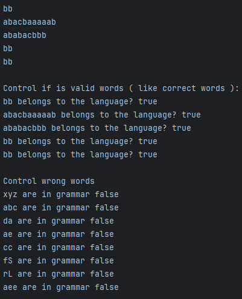

# Topic: Intro to formal languages. Regular grammars. Finite Automata.

### Course: Formal Languages & Finite Automata
### Author: Temciuc Adelina

----

## Theory
&ensp;&ensp;&ensp; A formal language can be considered to be the media or the format used to convey information from a sender entity to the one that receives it. The usual components of a language are:
- The alphabet: Set of valid characters;
- The vocabulary: Set of valid words;
- The grammar: Set of rules/constraints over the lang.
  **Connection in LFA:**
- **Finite automata** act as "checkers" to verify if a string belongs to a language.
- **Grammars** act as "builders" to generate all valid strings in a language.

Together, they help study how languages (like programming or pattern rules) are structured and processed.

**Grammar (in LFA):**  
A set of rules to build valid strings in a language, like a recipe. For example, if you want to make a valid sentence, the rules might say: "A sentence can be a noun followed by a verb." Then "noun" could be "cat" or "dog," and "verb" could be "runs" or "sleeps." Starting with the rule, you replace parts until you get a valid string (e.g., "cat runs"). Grammars define *how* to create correct sentences, while automata *check* if a sentence follows the rules.
**Finite Automaton (FA):**  
Imagine a simple machine that reads an input (like a string of symbols) step by step. It has a few "states" (like moods) and switches between them based on the input. For example, think of a door with a security code: it starts "locked," and if you enter the correct digits (input), it moves to "unlocked." If it ends in the "unlocked" state, the input is accepted. If not, it’s rejected. It’s like a flowchart that says "yes" or "no" to a sequence of steps.

##  Objectives:

1. Discover what a language is and what it needs to have in order to be considered a formal one;

2. Provide the initial setup for the evolving project that you will work on during this semester. You can deal with each laboratory work as a separate task or project to demonstrate your understanding of the given themes, but you also can deal with labs as stages of making your own big solution, your own project. Do the following:

   a. Create GitHub repository to deal with storing and updating your project;

   b. Choose a programming language. Pick one that will be easiest for dealing with your tasks, you need to learn how to solve the problem itself, not everything around the problem (like setting up the project, launching it correctly and etc.);

   c. Store reports separately in a way to make verification of your work simpler (duh)

3. According to your variant number, get the grammar definition and do the following:

   a. Implement a type/class for your grammar;

   b. Add one function that would generate 5 valid strings from the language expressed by your given grammar;

   c. Implement some functionality that would convert and object of type Grammar to one of type Finite Automaton;

   d. For the Finite Automaton, please add a method that checks if an input string can be obtained via the state transition from it;

## Implementation description

## Conclusions / Screenshots / Results

In conclusion, this lab gave me a nice opportunity to practice classes in JS (I didn't work with them for a long time). Also, due to this lab, I improved my knowledge about grammar and finite automaton and sustained my knowledge with practical tasks.

## References
- https://github.com/filpatterson/DSL_laboratory_works/blob/master/1_RegularGrammars/task.md
- https://en.wikipedia.org/wiki/Finite-state_machine